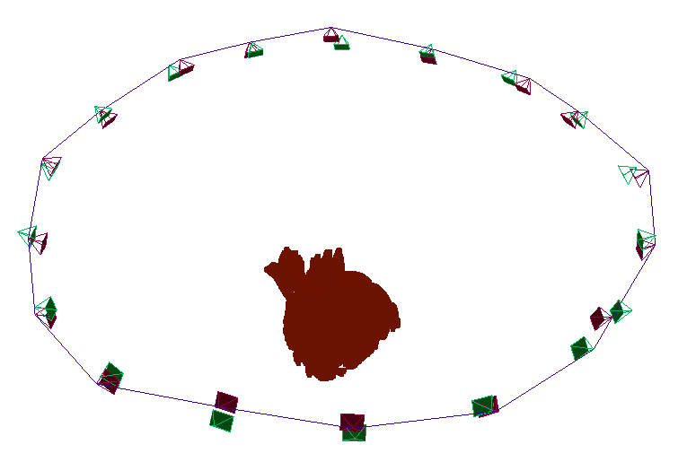
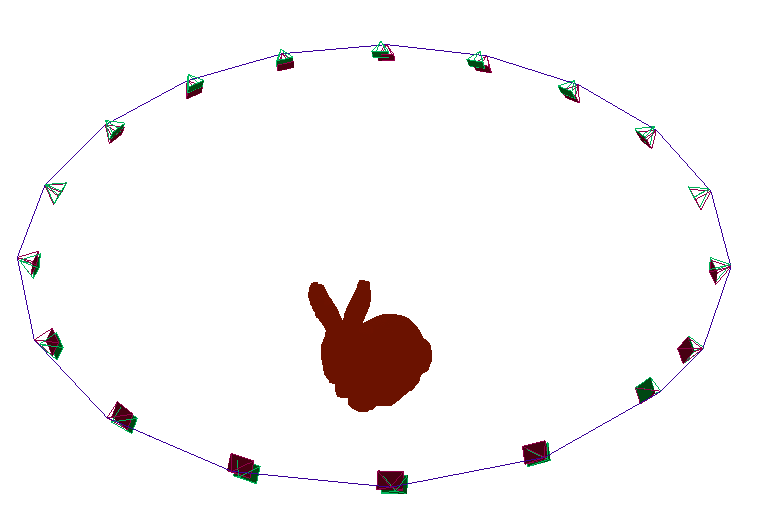

mv-lm-icp - Multiview Levenberg-Marquardt ICP
================================

The Iterative Closest Point (ICP) Algorithm extended to the multiview setting. Point-to-point and point-to-plane metrics.

A C++ implementation of Section 3.3.2 in:
* Fantoni, Simone, Umberto Castellani, and Andrea Fusiello. ["Accurate and Automatic Alignment of Range Surfaces."](http://www.diegm.uniud.it/fusiello/papers/3dimpvt12-a.pdf) 3DIMPVT (2012): 73-80.

Using [nanoflann](https://github.com/jlblancoc/nanoflann) for the kd-tree and [Ceres](http://ceres-solver.org/) for the actual minimization.

##### Rotation parameterization options:
* Angle axis (Ceres)
* Unit quaternion (Eigen)
* Lie algebra (Sophus)

##### For evaluation, we compare against the results 
* from [g2o](https://openslam.org/g2o.html) (pairwise, multiview) using GICP edges mimicking point-to-point, point-to-plane
* and the closed-form ICP solutions (only pairwise) to [point-to-point](http://graphics.stanford.edu/~smr/ICP/comparison/eggert_comparison_mva97.pdf), [point-to-plane](https://www.comp.nus.edu.sg/~lowkl/publications/lowk_point-to-plane_icp_techrep.pdf)

### Documentation
https://github.com/adrelino/mv-lm-icp/blob/master/docs/mv-lm-icp.pdf


### Background: ICP Variants
point-to-point:
* Besl, Paul J., and Neil D. McKay. ["Method for registration of 3-D shapes."](http://eecs.vanderbilt.edu/courses/CS359/other_links/papers/1992_besl_mckay_ICP.pdf) Robotics-DL tentative (1992): 586-606.

point-to-plane:
* Chen, Yang, and Gérard Medioni. ["Object modelling by registration of multiple range images."](http://graphics.stanford.edu/~smr/ICP/comparison/chen-medioni-align-rob91.pdf) Image and vision computing 10.3 (1992): 145-155.

### Previous work
* Fitzgibbon, Andrew W. ["Robust registration of 2D and 3D point sets."](http://citeseerx.ist.psu.edu/viewdoc/download?doi=10.1.1.83.3846&rep=rep1&type=pdf) Image and Vision Computing 21.13 (2003): 1145-1153.
* Brown, Benedict J., and Szymon Rusinkiewicz. ["Global non-rigid alignment of 3-D scans."](http://gfx.cs.princeton.edu/pubs/Brown_2007_GNA/global_tps.pdf) ACM Transactions on Graphics (TOG). Vol. 26. No. 3. ACM, 2007.
* Pulli, Kari. ["Multiview registration for large data sets."](https://graphics.stanford.edu/papers/pulli-3dim99/3dim99.pdf) 3-D Digital Imaging and Modeling, 1999. Proceedings. Second International Conference on. IEEE, 1999.


## Installation

### Dependencies

* required:
  * [cmake](https://cmake.org/)
  * [Eigen3](http://eigen.tuxfamily.org)
  * [Ceres Solver](http://ceres-solver.org/)
* optional:
  * [g2o - General Graph Optimization](https://github.com/RainerKuemmerle/g2o)

#### Mac OSX (>=El Capitan)

The easiest way is by first installing [homebrew](https://brew.sh) package manager:
```sh
/usr/bin/ruby -e "$(curl -fsSL https://raw.githubusercontent.com/Homebrew/install/master/install)"
```
The science tap has all our dependencies:
```
brew tap homebrew/science
brew install cmake eigen ceres-solver g2o
```
#### Windows (7 / 10)

* **Windows C++ Compiler** and/or IDE: 
  * [Microsoft Visual Studio IDE](https://www.visualstudio.com/de/downloads/) or just the [MSVC Compiler / Build Tools](http://landinghub.visualstudio.com/visual-cpp-build-tools) 
  * [Qt Creator IDE](https://www.qt.io/) which already includes the [MinGW](http://www.mingw.org/) or [MinGW 64](http://mingw-w64.org) Compiler. Also see here: https://wiki.qt.io/MinGW-64-bit
* **cmake**: Download and install CMake for windows, e.g. [cmake-3.11.0-rc3-win64-x64.msi](https://cmake.org/files/v3.11/cmake-3.11.0-rc3-win64-x64.msi) from https://cmake.org/download/.
* **Eigen3**: Download Eigen Source code (header only) and set the `EIGEN3_ROOT` environment variable to that directory in order to allow CMake to automatically find it. Otherwise manually specify the correct path in cmake-gui
* **Ceres Solver**: This is the hardes part to get compiled correctly on windows, especially with Sparse Matrix support, which is needed for good performance on our sparse toy problem since only neighbouring frames are connected in the graph. If no sparse solver is installed, use a dense (but slow) solver instead which is e.g. already included with Eigen. Here are the official installation instructions for windows:
http://ceres-solver.org/installation.html#windows

#### Debian based Linux (Ubuntu 17.10)

```sh
sudo apt install xorg-dev
sudo apt install cmake libeigen3-dev libceres-dev
```

`xorg-dev` is needed for [glfw on linux](http://www.glfw.org/docs/latest/compile_guide.html#compile_deps_x11)


`g2o` is not available in the official Ubuntu repositories, you have to options to install it:

* For long-term releases it can be installed via a ROS installation as [libg2o](http://wiki.ros.org/libg2o). E.g. for Ubuntu 14.04 [install ROS Indigo](http://wiki.ros.org/indigo/Installation/Ubuntu). Then 
```sh
sudo apt install ros-indigo-libg2o
```
* Compile and install yourself:
```sh
git clone https://github.com/RainerKuemmerle/g2o.git
git checkout 20170730_git
cd g2o && mkdir build && cd build
cmake -DG2O_BUILD_APPS=OFF -DG2O_BUILD_EXAMPLES=OFF ..
sudo make install
```
### Building
```sh
git checkout https://github.com/adrelino/mv-lm-icp.git
cd mv-lm-icp
git submodule update --init

mkdir build && cd build
cmake .. && make
```

### Execution

#### pairwise
```sh
./pairwise 
-0.076899 -0.081785     0.421	-0.226502 -0.628639 -0.743983
-0.076716 -0.080814      0.42	-0.167658 -0.600136  -0.78213
-0.076716 -0.080037      0.42	-0.270241  -0.48616 -0.831035
-0.076533 -0.079071     0.419	-0.305349 -0.342155 -0.888646
-0.076533 -0.078296     0.419	-0.373175  -0.41905 -0.827731
-0.076533 -0.077521     0.419	-0.342708 -0.344125 -0.874145
-0.076351 -0.076562     0.418	-0.436854 -0.442649 -0.783084
-0.076351 -0.075789     0.418	-0.436506 -0.404281 -0.803753
-0.076168 -0.074836     0.417	-0.438123 -0.443576  -0.78185
-0.076168 -0.074065     0.417	-0.437831 -0.405047 -0.802647

=====  TIMING[closed] is 0.712000 s


=====  TIMING[g2o] is 0.88537000 s


=====  TIMING[ceres CeresAngleAxis] is 0.74449000 s


=====  TIMING[ceres EigenQuaternion] is 0.85321000 s

analytic diff sophusSE3 local parameterization

=====  TIMING[ceres SophusSE3] is 0.83088000 s

=====  TIMINGS ====
ceres CeresAngleAxis:	0.074
ceres EigenQuaternion:	0.085
ceres SophusSE3     :	0.083
closed              :	0.001
g2o                 :	0.089

=====  Accurracy ====
ceres CeresAngleAxis	 diff_tra:7.76957e-11	 diff_rot_degrees:1.70755e-06

ceres EigenQuaternion	 diff_tra:6.31278e-11	 diff_rot_degrees:1.70755e-06

ceres SophusSE3    	 diff_tra:6.31278e-11	 diff_rot_degrees:1.70755e-06

closed form      	 diff_tra:6.5958e-15	 diff_rot_degrees:2.41484e-06

g2o              	 diff_tra:6.43487e-17	 diff_rot_degrees:0


```


#### multiview
```sh
./multiview
...
Visualize construct
graph adjacency matrix == block structure
0 1 0 0 0 0 0 0 0 0 0 0 0 0 0 0 0 1
1 0 1 0 0 0 0 0 0 0 0 0 0 0 0 0 0 0
0 1 0 1 0 0 0 0 0 0 0 0 0 0 0 0 0 0
0 0 1 0 1 0 0 0 0 0 0 0 0 0 0 0 0 0
0 0 0 1 0 1 0 0 0 0 0 0 0 0 0 0 0 0
0 0 0 0 1 0 1 0 0 0 0 0 0 0 0 0 0 0
0 0 0 0 0 1 0 1 0 0 0 0 0 0 0 0 0 0
0 0 0 0 0 0 1 0 1 0 0 0 0 0 0 0 0 0
0 0 0 0 0 0 0 1 0 1 0 0 0 0 0 0 0 0
0 0 0 0 0 0 0 0 1 0 1 0 0 0 0 0 0 0
0 0 0 0 0 0 0 0 0 1 0 1 0 0 0 0 0 0
0 0 0 0 0 0 0 0 0 0 1 0 1 0 0 0 0 0
0 0 0 0 0 0 0 0 0 0 0 1 0 1 0 0 0 0
0 0 0 0 0 0 0 0 0 0 0 0 1 0 1 0 0 0
0 0 0 0 0 0 0 0 0 0 0 0 0 1 0 1 0 0
0 0 0 0 0 0 0 0 0 0 0 0 0 0 1 0 1 0
0 0 0 0 0 0 0 0 0 0 0 0 0 0 0 1 0 1
1 0 0 0 0 0 0 0 0 0 0 0 0 0 0 0 1 0
```



```
press q to start optimization
```




